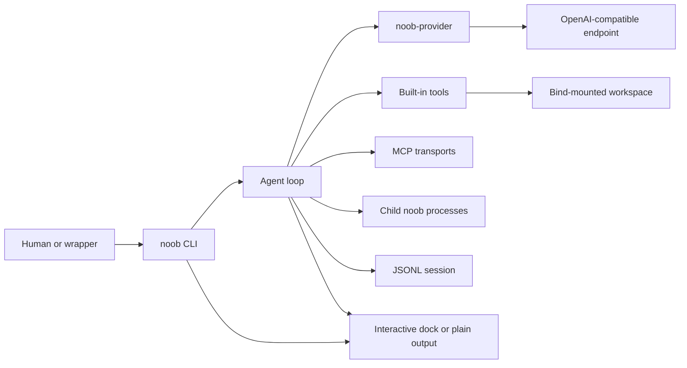
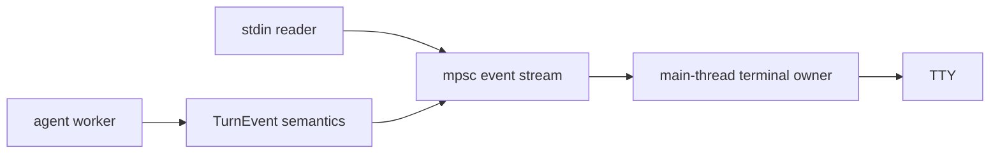

# noob-cli architecture

## Goals

noob-cli is a small, general-purpose agent for OpenAI-compatible endpoints. The shipped unit is one static Rust binary inside a Docker runtime. The workspace and configuration are bind mounts, so the image contains no project state, sessions, or secrets.

The design prioritizes:

- Small fixed prompt and dependency budgets.
- Byte-stable transcript replay for prompt-cache reuse.
- Compatibility with Chat Completions and Responses APIs.
- Deterministic file mutation and explicit failure remedies.
- Bounded memory for tools and untrusted integrations.
- Cancellation that remains responsive during network, process, pipe, and terminal activity.
- A rich interactive terminal without changing headless bytes or model input.

Linux on amd64 and arm64 is the supported host target. Other host operating systems are outside the current installer contract.

## Runtime flow



One user input can require several inference rounds. Each round streams a provider turn, commits a complete assistant item, executes any tool calls, appends one result per call, and repeats. A turn with no tool calls ends the input.

## Workspace layout

The Cargo workspace has three crates:

- `crates/noob`: binary, agent, tools, sessions, skills, MCP, child tasks, configuration, and UI.
- `crates/noob-provider`: HTTP client, watchdog, endpoint resolution, SSE, wire adapters, and neutral transcript types.
- `crates/noob-testkit`: test-only OpenAI and MCP servers plus wire-contract assertions.

Only `noob-provider` depends on the HTTP client. A crate-graph test enforces that boundary.

The builder selects `x86_64-unknown-linux-musl` for amd64 or `aarch64-unknown-linux-musl` for arm64. The runtime image contains Alpine, Bash, Git, CA certificates, Python 3, uv, a pinned `websearch-skill` tool environment, and the static binary.

## Distribution

`install.sh` builds the `noob:local` runtime image and installs a managed host launcher at `${NOOB_INSTALL_PREFIX:-$HOME/.local}/bin/noob`. The launcher bind-mounts the selected workspace and config directory, uses the caller's UID and GID, joins the host network, and removes the container on exit. `noob --resume <id>` (aliases `--restore` and `--session`) forwards directly to the binary's session resume path. The launcher forwards a fixed set of `NOOB_*` and proxy variables plus any names listed in `NOOB_ENV`, an opt-in allowlist for a workflow's own variables; it never forwards `NOOB_API_KEY`.

The installer seeds a global `web-search` skill and stdio MCP entry without overwriting existing files. Both invoke the same bundled Python package: standalone commands run as `websearch web-search`, `websearch web-fetch`, and related subcommands, while MCP runs as `websearch mcp`.

## Configuration

Configuration directory precedence is:

1. `NOOB_CONFIG_DIR`
2. `/config` when it exists
3. `~/.config/noob`

Setting precedence is CLI flag, then an allowed process environment key, then `<config>/.env`. The provider opens and parses `.env` for every model request, so configured endpoint, model, API style, and key edits apply on the next call unless a CLI or environment override pins the value. `NOOB_API_KEY` is read only from `.env` and is never exported to child tools. Context, sandbox, and task budgets are captured at bootstrap.

If no base URL is configured, startup probes loopback ports 8090, 8080, 11434, 1234, and 8000 in that order. An autodetected URL is pinned for that process. `NOOB_AUTODETECT=0` disables probing for deterministic automation and shared hosts.

Sandbox selection is explicit `NOOB_SANDBOX` first, then container detection. Container mode permits workspace tools to use the mounted environment. Workspace mode confines write and edit targets to the project and rejects symlink escapes. `--yolo` explicitly lifts that restriction.

## Provider boundary

`noob-provider` accepts a neutral transcript and returns semantic events plus a complete `Turn`.

The agent builds a `TurnRequestRef` each round to borrow the system prompt, transcript items, and tool schemas directly from their session-owned storage, so no round clones the full transcript. The owned `TurnRequest` carries the same three fields and exposes `.borrowed()` for callers that hold an owned request.

Both adapters share these rules:

- No request contains `max_tokens`, `max_output_tokens`, or an equivalent output limit.
- Streamed completions have no application length cap. Whole JSON completions are also read without a length cap.
- Chat and Responses output is normalized to text, reasoning, tool calls, usage, and a typed finish state.
- Responses requests use stateless replay with `store: false`; captured raw output items are replayed verbatim.
- A plain `application/json` response to a streaming request is parsed as a complete response.
- Retries are permitted only before streamed content reaches the caller.
- Proxy environment variables are ignored.

The custom blocking transport uses a watchdog around DNS, connect, request write, first-byte, and idle progress. Request writes use one-second ticks, check cancellation between writes, and have a 30-second no-progress deadline. Default connect, first-byte, and idle budgets are 10, 300, and 90 seconds. Retry backoff is 1, 2, and 4 seconds with jitter; `Retry-After` is honored up to 60 seconds.

HTTP error and auxiliary integration bodies can be bounded because they are not model completions. MCP JSON bodies are bounded before parsing, and rendered MCP results are capped again before entering the transcript.

## Transcript and cache invariants

The system prompt is assembled once in this order:

1. Embedded base prompt.
2. Environment facts.
3. Global and project `AGENTS.md`, each capped at 16 KiB.
4. The SKILL.md resolver index when skills exist.
5. One line naming configured MCP servers when any exist.

The fixed prompt plus all registered tool schemas must remain below the 1,500-token budget enforced by offline and live tokenizer tests.

Within a stable mode, each provider request is an exact byte-prefix extension of the prior request. The mock server checks serialized prefix bytes and tool-array stability on every turn. Deliberate prefix changes are limited to:

- Plan-mode entry and exit, which change the available schemas.
- First registration of the skill tool during an in-session skill reload.
- Context compaction.

The agent records the reason whenever it resets the cache baseline.

Provider error, content-filter, or incomplete length finishes are rejected before assistant content, tool execution, or session persistence can accept them as complete turns.

## Agent loop and scheduling

The user-facing agent permits at most 50 inference rounds per input. Doom-loop controls are structural:

- Three identical tool calls within the most recent twelve are intercepted.
- Four consecutive tool errors append a course-correction nudge.
- Eight consecutive tool errors ask the user in a terminal or abort headless execution.

The scheduler partitions one assistant tool batch in emission order:

- Consecutive read-only calls run on scoped threads, up to eight at once.
- Consecutive `subagent` calls form one fan-out group limited by child concurrency.
- Every other mutation is a sequential barrier.
- Results are returned and appended in emission order.
- Start events are emitted immediately before real execution.
- Parallel completion events are emitted in actual completion order.

Canceled outcomes carry a structural flag. The agent does not infer cancellation by matching result text, so tool output cannot forge it. A canceled call is removed from the repeated-call window and still receives one API-valid tool result.

Skills-directory write approvals are counted one-use grants tied to one planned batch. Unused grants are cleared after completion, cancellation, or a planning interruption.

## Context compaction

Compaction starts when the estimated context reaches 75 percent of `NOOB_CTX` or when the provider reports overflow.

The ladder is:

1. Replace older large tool results with deterministic placeholders.
2. If that is insufficient, summarize the middle against the fixed schema in `prompts/compact.md`.
3. Validate that a summary is non-empty, smaller, and structurally complete.
4. Retry one invalid summary, then prune or hard-drop instead of accepting it.

The head and recent tail stay verbatim, and call/result pairs are never split. A harness-built pin block preserves the original task, touched files, and loaded skills across repeated compactions and process resumes.

## Tools and bounded I/O

The core tools are `read`, `write`, `edit`, `bash`, `grep`, `glob`, `ls`, and `todo`. Conditional tools are `skill`, `mcp_connect`, `mcp_call`, and `subagent`.

Important mechanics:

- `todo` maintains a visible checklist the model overwrites wholesale on each call. The rendered `[x]`/`[~]`/`[ ]` text is the tool result, so every surface and the model transcript see the same plan. It mutates shared state, so it is a sequential barrier and is not a plan-mode tool.

- `read` opens with `O_NONBLOCK`, validates the opened handle with `fstat`, rejects non-regular files, and drains the full file in 64 KiB chunks. It hashes and counts all bytes while retaining only the requested page and line previews.
- `write` and `edit` use read-before-write stamps, same-directory temporary files, `fsync`, and rename. Existing mode bits are preserved.
- `edit` applies exact matching first, then trailing-whitespace, typographic, uniform-indent, and CRLF-compatible shadows. Every stage rejects ambiguity.
- `bash` merges stdout and stderr at the file-descriptor level, drains output continuously into a bounded 8 KiB head plus 16 KiB tail, and kills its process group on timeout or cancellation.
- `grep`, `glob`, and `ls` cap retained result entries or bytes and include an actionable continuation marker.
- Tool truncation occurs once before transcript insertion. It does not alter the underlying command or file operation.

The read and Bash loops check the shared interrupt flag. Partial Bash output can be retained in a structurally canceled outcome.

## Sessions

Sessions are append-only JSONL files under `<config>/sessions`. Fresh IDs contain hexadecimal time, process, and per-process serial components to avoid same-millisecond collisions.

Every append, flush, reset, and repair error is propagated. If persistence fails during a live run, the agent detaches the broken session, keeps the valid in-memory transcript, and shows one ordered warning. It never silently claims that an item was saved.

Resume streams the JSONL through a buffered reader, skips corrupt lines, repairs dangling tool calls with synthetic results, reconstructs compaction pins, and restores a provider-valid transcript without retaining stale pre-reset history. `--resume <id>` is the recovery flag, with `--restore` and `--session` as aliases; resuming an unknown id starts a fresh session with a note. At an interactive terminal a resumed conversation is also redisplayed before the first prompt (human turns, assistant Markdown, and one-line tool digests, with synthetic bookkeeping items filtered). The redisplay is display-only and does not touch the request body, the transcript, or the session log.

## Skills

Discovery checks project `.noob/skills`, `.claude/skills`, `.agents/skills`, then global `<config>/skills`. First name wins and each root is sorted. Directories listed in `NOOB_SKILL_PATHS` (colon-separated, resolved against the workspace) are indexed after the four roots, each registered as one resolver skill; the default roots win a name clash. This lets a workspace's own dispatcher at a non-root path such as `cli/SKILL.md` be discovered without copying it into a skills root.

The prompt contains a bounded name and description index. The `skill` tool loads the body on demand, and ordinary `read` loads referenced files.

`/skills add` accepts one local directory, one bare `SKILL.md`, or one Git URL. Candidate files must be bounded regular, non-symlink files; frontmatter parsing stops after a 64 KiB budget. Installation skips `.git`, copies into a hidden sibling staging directory, and publishes with one rename. A failed or canceled copy cannot expose a partial skill. Git clone runs in its own process group with bounded diagnostic capture, a 120-second wall clock, and cancellation. The dock remains active during installation.

Agent-authored write or edit targets inside a skills directory require a real terminal confirmation. Headless and child modes deny the operation. This is a guardrail on persistent instructions; Docker remains the security boundary for Bash.

## MCP

MCP configuration is merged from `<config>/mcp.json` and `<workspace>/.noob/mcp.json`, with project entries winning by name.

Startup only names servers. `mcp_connect` initializes one server and caches its tool catalog. `mcp_call` validates arguments against the cached schema before transport.

stdio transport:

- Newline-delimited JSON-RPC with an 8 MiB inbound line bound.
- A 16-message inbound queue, so a noisy server receives pipe backpressure.
- Nonblocking stdin writes with timeout and interrupt checks.
- A 50 ms receive poll so silent servers cannot hide cancellation.
- Process-group kill and reap on timeout, cancellation, or drop.
- Transparent respawn on the next request.

Streamable HTTP transport:

- JSON or event-stream responses with an 8 MiB total response budget.
- Session ID replay and one re-initialization on 404.
- Protocol-version headers after initialization.
- An absolute per-call deadline, so keepalive traffic cannot extend a call forever.

Server catalogs and results are wrapped as untrusted content before transcript insertion.

## Child agents

The `subagent` tool spawns `current_exe() child` with a JSON task on stdin. The child gets a fresh prompt and no parent history. It writes progress to stderr and exactly one JSON result line to stdout. Only the result field enters the parent transcript.

Defaults are four concurrent children, 25 rounds, 300 seconds, and recursion depth two. The parent starts the wall clock before sending the task. Child stdin is nonblocking and cancellation-aware, the final result line is read without an output-length cap, and optional progress retention is bounded at 64 KiB while both streams continue to drain.

These are loop and transport budgets, not output-token limits.

## Terminal architecture

Interactive mode uses a session-long raw terminal guard and three cooperating paths:



The main thread is the only terminal writer. The worker emits semantic text, reasoning, tool start, tool finish, note, error, ask, and end events. Adjacent render events can share an 8 ms repaint window; asks, keys, reader loss, and end are strict ordering barriers.

The active frame always has three rows:

1. Animated comet, elapsed time, plan state, and active tools.
2. Editable draft or confirmation question.
3. Queue count and cancellation state.

Entering a message during a turn immediately records it above the frame as queued. At most one queued message is dispatched after a turn. Cancellation drains queued messages back into the draft. Escape twice within five seconds cancels; Ctrl-C cancels immediately; a second Ctrl-C during cancellation restores the terminal and exits with status 130.

Reader loss is an ordering barrier. Keys accepted before EOF are processed first, pending confirmations are denied, and the REPL exits once queued work is drained rather than waiting on an input thread that can no longer answer.

Assistant Markdown is parsed only for the interactive REPL. The line-streaming renderer supports headings, emphasis, code spans, lists, quotes, fenced code, JSON accents, and GFM-style tables. Tables switch to stacked records on narrow terminals and size their cells by terminal display width so wide glyphs keep the borders aligned. Parser buffers are bounded, but overflow degrades to literal streaming and never drops model output.

Two display-only artifacts reuse the checklist glyphs: the `todo` tool's `[x]`/`[~]`/`[ ]` plan, and an agents panel that folds a `subagent` fan-out of two or more parallel sub-agents into one checklist with per-agent status, a one-line result and turn count, and the concurrency cap in the header. The input editor completes a `/`-prefixed command on Tab (a dim hint lists candidates for an ambiguous prefix) and shows a dim placeholder while a turn runs and the buffer is empty. None of these alter the transcript or the headless bytes.

Model text and all untrusted summaries are sanitized so control bytes cannot execute terminal commands. `NO_COLOR` removes color without removing structure, liveness, or reasoning text.

Piped REPL, `exec`, `exec --json`, and `child` bypass the rich renderer. Their protocol bytes remain plain and stable.

## Verification budgets

The enforced release budgets are:

| Budget | Limit | Current validation |
|---|---:|---:|
| Static release binary | 8 MiB | Re-measured by `./dev.sh size-check` |
| Runtime dependency graph | 45 crates | 40 crates |
| Fixed prompt plus schemas | 1,500 tokens | Offline and live tokenizer checks |
| Offline tests | None | 586 tests, plus 8 opt-in live tests |

The required local gates are:

```bash
cargo clippy --workspace --all-targets --locked -- -D warnings
cargo test --workspace --locked
./dev.sh test
./dev.sh size-check
```

Live checks use `./dev.sh smoke`. By default, the websearch MCP test additionally requires its Streamable HTTP endpoint on port 8000. `NOOB_LIVE_BASE_URL` and `NOOB_LIVE_MCP_URL` select other live endpoints. Installer tests cover the host wrapper with a fake Docker process; release validation also builds and runs the real image, standalone websearch CLI, and stdio MCP handshake.
