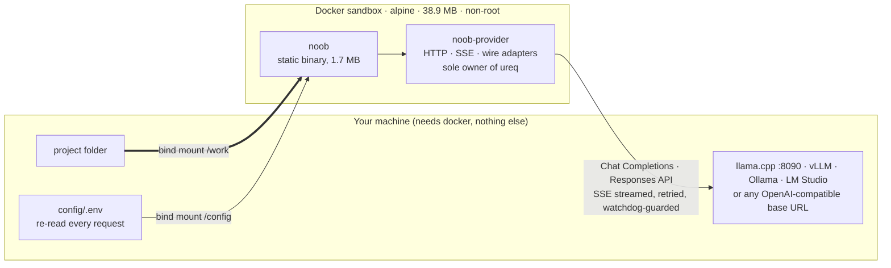

<h1 align="center">noob</h1>

<p align="center">
  <strong>An agentic coding CLI that assumes you know nothing: one 1.7 MB static binary in a Docker sandbox, pointed at whatever local model you already run.</strong>
</p>

<p align="center">
  
  
  
  
</p>

<p align="center">
  
  
  
  
  
</p>

The name is the design goal: you should be able to use this knowing nothing. `docker compose run` lands in a working chat. No wizard, no learning curve, no host install beyond Docker itself.

## What this is

A lightweight agentic coding CLI in Rust. The binary lives inside a Docker container (that container is the sandbox), works on your project through a bind mount at `/work`, and speaks both OpenAI wire shapes, Chat Completions and Responses, against any base URL: llama.cpp, vLLM, Ollama, LM Studio, OpenAI, OpenRouter. Small local models (qwen-class through llama.cpp) are the first-class target, so every design choice optimizes for a tiny prompt budget, byte-stable cache prefixes, and error messages that tell the model what to do next.

Why another one? Most lean harnesses pick one wire shape (Codex CLI is Responses-only, OpenCode is Chat-first); noob speaks both against any URL, and small local models are the primary target rather than a fallback. The design comes from studying Pi, OpenCode, Codex CLI, Hermes Agent, Agent Zero, Zerostack, zot, Zap, and Zero; no code was copied from any of them. The full survey is in [docs/RESEARCH.md](docs/RESEARCH.md).

## What works today

The provider layer (P1) is done, in active development. Working right now:

- The whole workspace builds inside Docker; the host needs docker and a shell, nothing else.
- `docker compose run --rm noob exec -p "your prompt"` streams the answer token by token through a local model, on either wire shape (Chat Completions and Responses).
- Tool calls parse correctly from real llama.cpp streams, including two calls in one inference; verified live against qwen3.6, both shapes, full round trip with the tool result replayed through the template.
- A byte-exact SSE parser survives every TCP split (tested by re-splitting a real capture at every byte offset), plus a quirk matrix for the ways servers bend the spec: missing tool-call ids, arguments as objects, keepalive comments, mid-stream error payloads.
- Retries with backoff before the first content byte (never after: that would duplicate output), `Retry-After` honored, and a reactive fallback that strips a request field an endpoint 400s on and remembers for the session.
- Hot config reload: `.env` is re-read on every request, so edits apply on the next call with no container restart.
- A 1 s tick-read watchdog keeps Ctrl-C responsive within about a second, even while llama.cpp spends minutes of silence processing a 131k-token prompt, and even mid-retry-backoff.
- 114 offline tests via `./dev.sh test` (e2e through the compiled binary against a mock OpenAI server), 3 live smokes via `./dev.sh smoke`.

The REPL, the tool set, and the agent loop are the next phase; the roadmap below marks exactly what exists and what does not.

## Quickstart

```bash
git clone https://github.com/hec-ovi/noob-cli.git
cd noob-cli
cp config/.env.example config/.env   # edit NOOB_BASE_URL if your endpoint differs
./dev.sh exec "say hi"               # or: docker compose run --rm noob exec -p "say hi"
```

The first run builds the image (musl static build, all inside Docker). `NOOB_BASE_URL` is the one key you need today; localhost endpoint autodetect lands in P2, after which an empty config also works.

## Config

One flat `.env` in the bind-mounted config dir. All keys optional, everything commented in [config/.env.example](config/.env.example). The file is re-read on every request: change the model or rotate a key mid-session and the next call uses it. Keys never enter the process environment, so shell commands and (later) child agents cannot read them.

| Key | Default | What it does |
|---|---|---|
| `NOOB_BASE_URL` | unset (required until P2) | OpenAI-compatible `/v1` base URL |
| `NOOB_API_KEY` | empty | API key, if the endpoint wants one; local servers usually accept anything |
| `NOOB_MODEL` | `default` | Model name as the endpoint knows it |
| `NOOB_API_STYLE` | by host | `chat` or `responses`; `api.openai.com` defaults to responses, everything else to chat |
| `NOOB_CTX` | `131072` | Context window in tokens; compaction (P2) starts at 75% |
| `NOOB_TASK_CONCURRENCY` | `4` | Concurrent sub-agent cap (P6) |
| `NOOB_TASK_MAX_TURNS` | `25` | Per-sub-agent turn cap (P6) |

## How it fits together



Two shipped crates plus a dev-only one: `noob` (the binary: argv dispatch, agent loop, tools, UI) depends on `noob-provider` (transcript in, events out, the only crate allowed to touch the network); `noob-testkit` is the hand-rolled mock OpenAI server the e2e suite runs against, never a runtime dependency. The compose file uses `network_mode: host` so the container reaches model servers on host loopback, and runs as your UID so files written to `/work` are never root-owned.

## Design rules

The opinionated bits. Where a rule says "test-enforced" that is literal: the mock server checks it on every request.

| Rule | Why |
|---|---|
| No request ever carries a `max_tokens`-family key; there is no config knob for one (test-enforced) | A capped response truncates mid-answer and breaks structured output; length is shaped by instructions, never by a ceiling |
| Append-only prompt: every request is an exact prefix extension of the previous one (test-enforced) | llama.cpp prefix KV reuse and provider prompt caching make turn N+1 cost only the new suffix |
| System prompt budget locked at 1,500 tokens total fixed overhead (about 1.1% of a 131k context) | Small models lose the thread in long prompts; the budget is measured on the shipped artifact |
| Edit is exact string replace with a deterministic fallback ladder, no similarity-score fuzzing, ever (P2) | A fuzzy match can corrupt a file silently; a rejection comes back with the actual file region so the model can retry correctly |
| The container is the sandbox | No permission-rule DSL: isolation comes from Docker; outside a container the binary falls back to a restricted workspace mode |
| No telemetry: the binary talks only to the configured endpoints | No update checks, no phoning home; only `noob-provider` may touch the network stack, checked against the crate graph |
| State lives in the mounts, never in the image | The image contains zero config, keys, or sessions; `docker rmi` loses nothing of yours |
| No async runtime, no tokio, no clap, no serde derive; ureq pinned at 3.3.0 | 28 runtime crates against a hard budget of 45; one inference at a time needs threads, not a reactor |

## Roadmap

| Phase | Scope | Status |
|---|---|---|
| P0 scaffold | Workspace, contracts, Docker build, mock OpenAI server, `exec` skeleton, watchdog | done |
| P1 provider layer | SSE streaming, Responses adapter, tool-call parsing, retry/backoff | done |
| P2 core loop + tools | Interactive REPL, the 7 file/shell tools, agent loop, system prompt, compaction, sessions, endpoint autodetect | next |
| P3 skills | SKILL.md discovery with progressive disclosure ([agentskills.io](https://agentskills.io) standard) | |
| P4 MCP client | stdio + Streamable HTTP transports, lazy connect | |
| P5 plan mode | Read-only exploration, explicit `/go` approval | |
| P6 multi-agent | Self-spawning sub-agents, parallel fan-out, concurrency and turn caps | |
| P7 hardening + release | `doctor`, live gauntlet, integrations, v0.1 (static binary + image) | |

Where it lands at v0.1: seven file/shell tools with parallel calls, SKILL.md skills, an MCP client, plan mode, sub-agents the binary spawns from itself, and a headless JSONL surface (`exec --json --session`) built to be driven by other CLI agents, not just humans.

## Development

Everything runs inside Docker; nothing is installed on the host. `./dev.sh` is the task runner (plain bash; a thin Makefile delegates to it if you prefer `make test`). Every folder ships a `contract.md` stating its purpose, interface, and invariants, and nothing about the rest of the system. There is no CI: `./dev.sh test` is the whole story.

| Target | What it does |
|---|---|
| `./dev.sh test` | The offline suite: 114 unit + e2e tests against the in-process mock server, run in a dev container |
| `./dev.sh build` | The static musl release binary |
| `./dev.sh docker` | The runtime image |
| `./dev.sh repl` / `./dev.sh exec "..."` | Compose with your uid:gid passed explicitly, so files under `/work` keep your ownership |
| `./dev.sh smoke` | Live suite against local endpoints (opt-in, `NOOB_LIVE=1`) |
| `./dev.sh size-check` | Fails if the binary exceeds 8 MB or the runtime crate graph exceeds 45 |

The v0.1 exit bar is an all-terrain live gauntlet (PLAN.md, Testing): hard multi-step prompts, several tool calls per inference, session close/resume cycles with recall checks, interrupts at the nastiest points, and a chaos pass of random SIGINTs. The whole thing runs against a small local model, and it is driven agent-to-agent through the headless surface, so being operable by another agent is proven by construction.

## License

[MIT](LICENSE). Built by Hector Oviedo ([hec-ovi](https://github.com/hec-ovi)).
